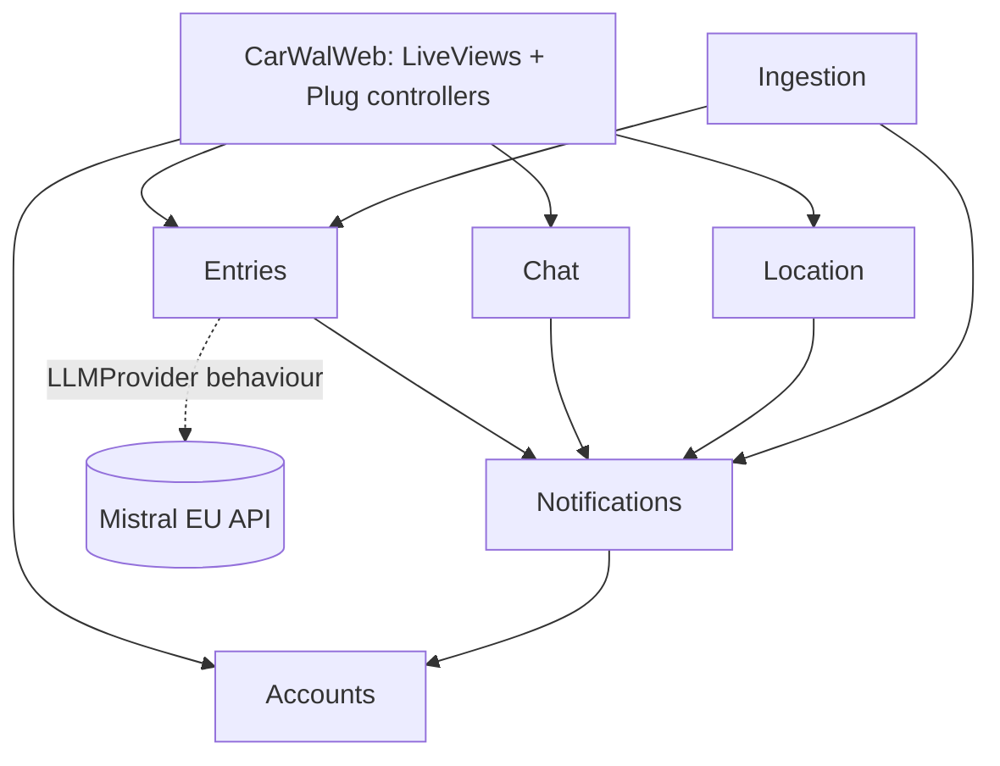

# Architecture Spine — CarWal

## Design Paradigm

**Phoenix contexts.** Domain logic lives in six context modules under `CarWal.*`; the web layer (`CarWalWeb.*`, LiveViews + controllers) is a thin caller. A context owns its tables, schemas, and business rules; nothing else touches them.

## Invariants & Rules

### AD-1 — Six contexts, one owner per table

- **Binds:** all
- **Prevents:** two write paths on one table; cross-context Repo access.
- **Rule:** Contexts and their owned tables: `Accounts` (users, membership seed) · `Entries` (entry, entry_revisions; includes `Entries.Suggestions` submodule) · `Ingestion` (feed state; **no entry writes except via `Entries` API**) · `Chat` (messages) · `Location` (nothing persisted) · `Notifications` (push_subscriptions). A module reads/writes another context's data only through that context's public functions.



### AD-2 — Web layer never touches persistence

- **Binds:** all
- **Prevents:** business rules leaking into LiveViews; untestable UI-coupled logic.
- **Rule:** `CarWalWeb` modules call context functions only — never `Repo`, Ecto schemas, or changesets directly. Auth-scoped access follows the Phoenix 1.8 scopes pattern. [ADOPTED]

### AD-3 — Direct calls for logic, PubSub only for UI

- **Binds:** all
- **Prevents:** an invisible event bus; lost side effects; two coupling styles.
- **Rule:** Cross-context effects are explicit function calls (e.g. `Ingestion` → `Entries.upsert_from_feed/2`, `Entries` → `Notifications.notify/2`). `Phoenix.PubSub` carries **UI refresh only**: the owning context broadcasts after commit; LiveViews subscribe. No domain decision may depend on receiving a broadcast.

### AD-4 — All realtime over LiveView

- **Binds:** FR7, FR8, FR11
- **Prevents:** a second socket + channel-JS programming model beside LiveView.
- **Rule:** Chat renders via LiveView streams + PubSub; live location uses Phoenix.Presence on the LiveView socket with a JS hook for the Geolocation API. No standalone Phoenix Channels, no custom channel client code. Chat is exactly **one family room** — no room/thread model.

### AD-5 — Occurrences are materialized

- **Binds:** FR1, FR6, FR9, FR13
- **Prevents:** RRULE/occurrence math duplicated in calendar, digest, and reminder code.
- **Rule:** Recurring events (feed RRULEs, seeded birthdays) are expanded into individual `entry` rows over a rolling ~14-month horizon. All expansion lives in `Ingestion` — birthdays are an `Ingestion` source fed from seed config (`source: :seed`) through the same `Entries.upsert_from_feed/2` path; `seeds.exs` writes **config only**, never entry rows. The horizon-extension Oban job lives in `Ingestion`. Everything downstream reads flat rows.

### AD-6 — Ingestion is idempotent and diffed

- **Binds:** FR1, FR2
- **Prevents:** duplicate entries per poll; silent mutation of moved events.
- **Rule:** Feed upserts key on `(source, external_uid, occurrence_date)` — enforced by a partial unique index scoped to ingested/seed sources (manual/AI rows have no external_uid). A changed ingested entry writes an `entry_revisions` row (scope: ingested entries only) and updates in place; a vanished occurrence is flagged, never deleted. Non-whitelisted mail is left unread and only counted. **No automatic calendar/mail dedup or merging** — linking a mail entry to the event it announces is a manual user action via `parent_id` (the same self-referential relationship ideas use).

### AD-7 — Notifications route through one table of defaults

- **Binds:** FR3, FR6, FR7, FR8, FR13
- **Prevents:** each feature hand-rolling recipient logic; push fatigue drift.
- **Rule:** Only `Notifications` sends Web Push. Recipients come from the seeded role-default routing (school entries → mother; digest → adults; reminders → creator/addressee; chat → all but sender; location request → target; feed health → operator). Payloads stay minimal ("New message"); detail is fetched on open. Scheduling contract: `Entries` calls `Notifications.schedule_reminder(entry)` on **every** `remind_at` mutation (create/update/clear) — `Notifications` upserts/cancels the Oban job keyed by entry id; the 07:00 digest cron calls `Entries.digest_for(recipient, date)`. No sweep-and-poll for due reminders.

### AD-8 — Location is ephemeral

- **Binds:** FR8, NFR2
- **Prevents:** accidental location persistence (liability for minors).
- **Rule:** `Location` holds shares and positions in process state/Presence only — no Ecto schema, no table, no log line containing coordinates. Shares carry a TTL (15/30/60 min) enforced server-side. [ADOPTED]

### AD-9 — AI behind `LLMProvider` behaviour, minimal egress

- **Binds:** FR9, NFR1
- **Prevents:** provider lock-in; whole-entry-graph leakage to the API.
- **Rule:** `Entries.Suggestions` calls a `CarWal.LLMProvider` behaviour (`suggest/1`); default adapter Mistral EU, output German. The request payload contains at most event title + type. Suggestions land as entries with `source: :ai, status: :proposed, visibility: :owner_only`; proactive generation fires **at most once per occasion event** (volume guard); accept sets `status: :active` and flips visibility to `:family` unless the user keeps it private; dismiss sets `status: :dismissed`. [ADOPTED]

### AD-10 — Visibility is enforced in context queries

- **Binds:** FR4, FR9
- **Prevents:** `owner_only` leaking through one forgotten `where` clause (a child seeing her surprises).
- **Rule:** `Entries` exposes a two-tier read API. **User-scoped reads** (everything `CarWalWeb` calls) take the acting user and apply the visibility filter inside the context — no caller-side filtering. **System reads** are an enumerated, named set (`digest_for/2`, ingestion diff lookups, horizon scans); `digest_for(recipient, date)` is visibility-scoped **as that recipient**, and `owner_only` content never appears in any other user's push or digest. No other unscoped read path exists.

### AD-11 — Media bypasses the LiveView socket

- **Binds:** FR7
- **Prevents:** blobs through the websocket; unauthenticated file serving.
- **Rule:** Uploads/downloads go over HTTP through an authenticated Plug controller against a `CarWal.Storage` behaviour (local-disk adapter in v1). ~25 MB/file cap. [ADOPTED]

### AD-12 — One `entry` status machine, closed enums

- **Binds:** FR1–FR6, FR9
- **Prevents:** each story inventing its own slice of the shared `entry` lifecycle — one column carrying incompatible state machines.
- **Rule:** Closed value sets, defined once in the `Entries` schema:
  `type ∈ {appointment, task, idea, message}` · `source ∈ {ical, email, seed, manual, ai}` · `status ∈ {active, moved, cancelled, done, proposed, dismissed}` · `visibility ∈ {family, owner_only}`.
  Who may set status: `Ingestion` sets `active/moved/cancelled` on ingested/seed rows; users toggle `done` on `type: :task`; AI rows start `proposed` and move only to `active` (accept) or `dismissed`. Any new value or transition is a spine change, not a local addition.

### AD-13 — One push pipeline, one app shell

- **Binds:** FR6, FR7, FR11, FR13
- **Prevents:** two stories each shipping their own service-worker/subscription code (breaking multi-device push) or their own navigation shell; ad-hoc PubSub topic names.
- **Rule:** Exactly one service worker + one push JS hook; subscriptions register via `Notifications.register_subscription(user, endpoint, keys)` stored **per device** keyed `(user_id, endpoint)`. All authenticated LiveViews live in a single `live_session` sharing one layout/nav shell. Canonical PubSub topics: `"entries"`, `"chat"`, `"location"` — no others without a spine update.

## Consistency Conventions

| Concern | Convention |
| --- | --- |
| Time | Store `utc_datetime`; render and schedule user-facing times in `Europe/Berlin` wall time (digest fires 07:00 Berlin) |
| Enums | `entry.type/status/source/visibility` as Ecto `Ecto.Enum` atoms; single source in the `Entries` schema |
| IDs | Bigint PKs (phx defaults); external references via `(source, external_uid)` |
| i18n | `gettext`, German default locale; all user-facing strings through gettext from day one |
| Errors | Context functions return `{:ok, _} | {:error, changeset_or_atom}`; no raising across context boundaries |
| Jobs | Anything scheduled or retryable is an Oban job in the owning context's namespace |
| Config | Runtime config via `runtime.exs` env vars; family/roles/feeds/whitelist/birthdays via seed script |
| Outbound mail | Swoosh SMTP adapter through the German sovereign mailbox (mailbox.org/Posteo) — magic links and any future mail; never a non-EU mail SaaS (NFR1) |
| Tests | ExUnit + DataCase per context's public functions; Mox for behaviours (`LLMProvider`, `Storage`); one render smoke test per LiveView. No test writes through another context's schema |

## Stack

| Name | Version |
| --- | --- |
| Elixir / OTP | 1.20.x / OTP 27+ |
| Phoenix (`mix phx.new` defaults: Bandit, esbuild, Tailwind 4 + daisyUI 5) | 1.8.8 |
| Phoenix LiveView | 1.2.x |
| Oban (OSS, Cron plugin) | 2.23.x |
| PostgreSQL | 18.x |
| tz (tzdata, Europe/Berlin wall-time DB) | ~> 0.28 |
| ical (ICS parsing) | ~> 2.0 |
| Swoosh (outbound SMTP, phx default) | bundled |
| yugo (IMAP) | 1.0.x |
| ex_nudge (Web Push / VAPID) | 1.0.x |
| mistral (Req-based client) | 0.5.x |
| Leaflet (OSM map, vendored asset) | 1.9.x |
| Caddy (TLS) · Docker Compose | current |

## Structural Seed

```text
carwal/
  lib/carwal/            # contexts: accounts/ entries/ ingestion/ chat/ location/ notifications/
  lib/carwal_web/        # live/ (LiveViews), controllers/ (media, health), components/
  priv/repo/             # migrations, seeds.exs (family, roles, feeds, whitelist, birthdays)
  assets/                # js hooks (geolocation, push), tailwind
  deploy/                # compose.yml, Caddyfile, deploy.sh (buildx --platform linux/amd64)
```

Deployment: single Hetzner VPS, Docker Compose (app + Postgres + Caddy); image built on M1 Mac with `--platform linux/amd64`, shipped `docker save | ssh | docker load`; migrations via `bin/carwal eval "CarWal.Release.migrate()"` post-load, pre-restart. Backup: `restic` pull over SSH from the FileVault'd MacBook via `launchd`; restore script lives in `deploy/` and is tested once against a scratch box (FR12). One environment (prod) + local dev; no staging.

Client envelope: installable PWA over HTTPS only. Daughter's Android runs Google Family Link — onboarding runbook: whitelist the domain, temporarily enable "Permissions for sites", grant notifications + geolocation (grants persist). Downtime windows silence pushes on her device; accepted. TWA via Play private track is the P2 fallback.

## Capability → Architecture Map

| Capability | Lives in | Governed by |
| --- | --- | --- |
| FR1/FR2 ingestion | `Ingestion` | AD-1, AD-5, AD-6 |
| FR3 feed health | `Ingestion` + `CarWalWeb` | AD-6, AD-7 |
| FR4/FR5 entries & ideas | `Entries` | AD-1, AD-10, AD-12 |
| FR6 reminders · FR13 digest | `Notifications` (Oban) | AD-7, AD-13, conventions (Time) |
| FR7 chat + media | `Chat` + `CarWal.Storage` | AD-3, AD-4, AD-11 |
| FR8 live location | `Location` | AD-4, AD-8 |
| FR9 AI suggestions | `Entries.Suggestions` | AD-9, AD-10 |
| FR10 auth · FR11 PWA | `Accounts` + `CarWalWeb` | AD-2, AD-13, stack (phx.gen.auth magic link), conventions (Outbound mail) |
| FR12 backup | `deploy/` + Mac launchd | Structural Seed (ops) |

## Deferred

- **SearXNG grounding (P1):** second `LLMProvider`-adjacent concern; decide its seam when built — AD-9 already isolates it.
- **English UI toggle (P1):** gettext locale per user pref; no structural decision needed now.
- **Object storage for media:** `CarWal.Storage` behaviour is the seam; adapter choice deferred until durability is wanted.
- **TWA shell (P2):** only if Family Link friction chafes; no server-side impact.
- **Visibility UI beyond ideas (P2):** field ships everywhere (AD-10); per-type UI exposure decided per feature later.
- **Postgres tuning, PITR, staging env:** out of scope at this write volume by PRD decision.
